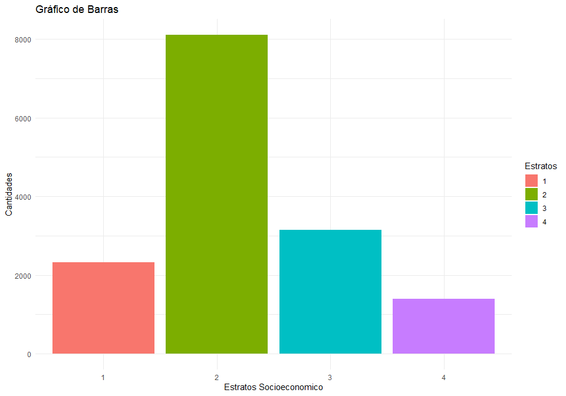
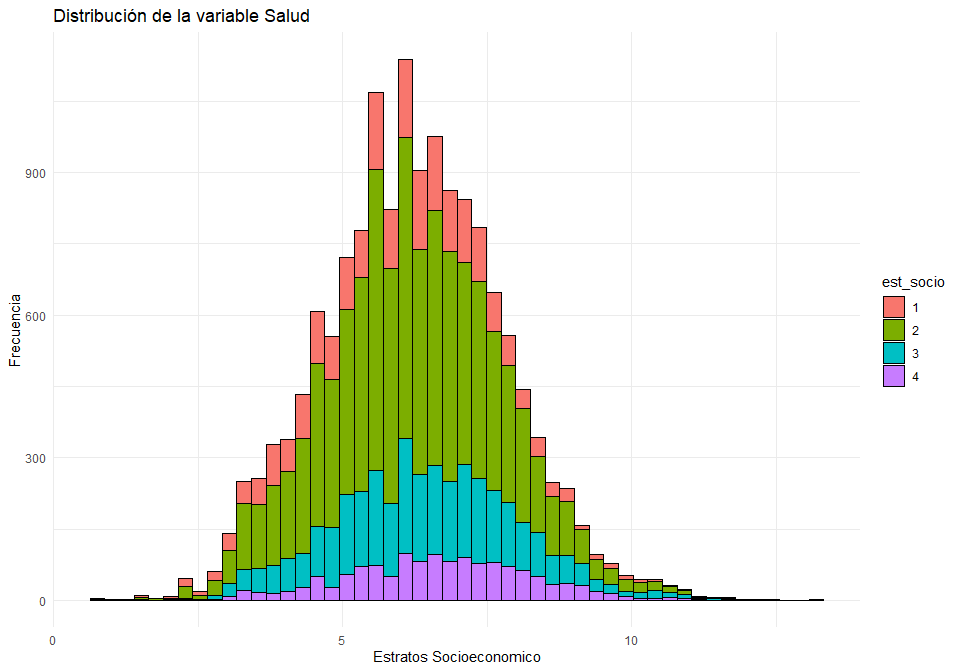
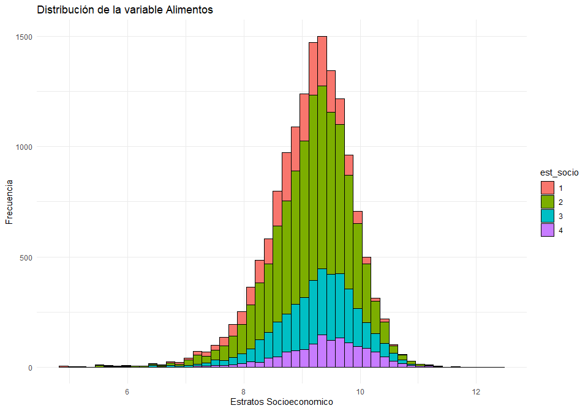
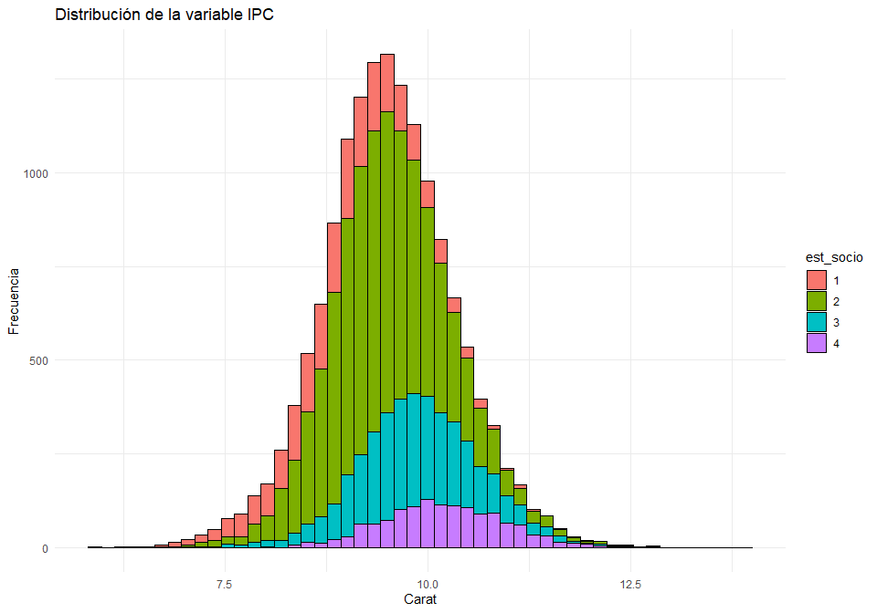
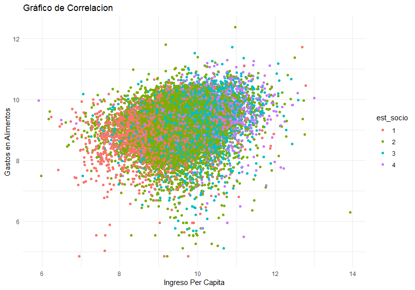
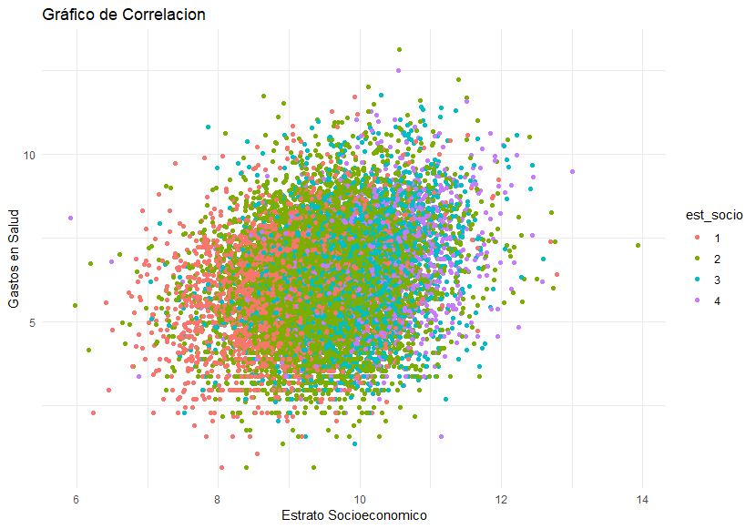

<style>
body {
text-align: justify}
</style>


Para este ejercicio, estaremos trabajando con la data Hogares_enight (Encuesta Nacional de Ocupación y Empleo de México 2019) Realizando un pequeño analisis exploratorio de los datos:

## DATA


```r
enigh%>%head()%>%pander() 
```


--------------------------------------------------------------------------------
 folioviv   foliohog   ubica_geo   tam_loc   est_socio   est_dis   upm   factor 
---------- ---------- ----------- --------- ----------- --------- ----- --------
  1e+08        1         1001         1          3          2       1     190   

  1e+08        1         1001         1          3          2       1     190   

  1e+08        1         1001         1          3          2       2     189   

  1e+08        1         1001         1          3          2       2     189   

  1e+08        1         1001         1          3          2       2     189   

  1e+08        1         1001         1          3          2       2     189   
--------------------------------------------------------------------------------

Table: Table continues below

 
-------------------------------------------------------------------------
 clase_hog   sexo_jefe   edad_jefe   educa_jefe   tot_integ   percep_ing 
----------- ----------- ----------- ------------ ----------- ------------
     2           2          48           9            3           2      

     2           1          46           8            4           2      

     2           1          26           10           2           2      

     2           1          29           8            2           1      

     2           1          63           10           2           1      

     2           1          33           6            4           1      
-------------------------------------------------------------------------

Table: Table continues below

 
--------------------------------------------------------------------------------
 ing_cor    ingtrab    gasto_mon   alimentos   vesti_calz   vivienda   limpieza 
---------- ---------- ----------- ----------- ------------ ---------- ----------
 16229.49   13278.68   24626.04     14732.8        0          2850       375    

 31425.68   22254.09    20397.1     9321.32        0         2308.5      924    

 33979.16   33979.16   44955.73    15081.32      1006.6      11097     2530.16  

 71557.37   71557.37   82950.42    26921.53     4509.73     13984.5      708    

 90703.26   48113.11   30140.68    11969.93        0         3179.5     920.8   

 30368.84   30368.84   39991.94     7547.03      371.73      12450       408    
--------------------------------------------------------------------------------

Table: Table continues below

 
-------------------------------------------------------------
  salud    transporte   educa_espa   personales   transf_gas 
--------- ------------ ------------ ------------ ------------
    0       5447.24        120          1101          0      

  782.6     4915.68         0           2145          0      

 4509.77    7029.68       693.44      2766.78       240.98   

  39.13     7022.39      26408.75      2767.3       589.09   

 2412.39    7154.75        1440        112.5       2950.81   

 229.87     16171.31       1035         1779          0      
-------------------------------------------------------------


## PLOTS
Iniciamos generando un grafica de barras para identificar el tamaño de cada uno de estos estratos socioeconomicos


```r
ggplot(data = enigh, aes(x = est_socio, fill = as.factor(est_socio))) + 
  geom_bar() + 
  xlab("Estratos Socioeconomico") + 
  ylab("Cantidades") + 
  ggtitle("Gráfico de Barras") +
  labs(fill = "Estratos") + 
  theme_minimal()
```

<!-- -->

Claramente identificamos que el estrato numero 2 muestra una gran diferencia entre los demás estratos, siendo este el más significativo entre los hogares mexicanos 

Posteriormente elaboramos los histogramas de los datos que usaremos (salud, alimentos, IPC) con la categoría de los estratos socioeconómicos


```r
ggplot(enigh) +
  geom_histogram(bins = 50,
                 aes(x = ln_salud, fill = est_socio),
                 color = 'black') +
  xlab("Estratos Socioeconomico") +
  ylab("Frecuencia") +
  ggtitle("Distribución de la variable Salud") +
theme_minimal()
```

<!-- -->

Para los gastos en salud podemos identificar que los estratos 1 y 2 com se encuentran agrupados un poco mas a la derecha, esto quiere decir que hay una asimetría positiva que ellos pueden destinar un mayor gasto en salud, lo que no sería extraño
que para todos los estratos muestran una centralidad similar y una distribución normal 


```r
ggplot(enigh) +
  geom_histogram(bins = 50,
                 aes(x = ln_alimentos, fill = est_socio),
                 color = 'black') +
  xlab("Estratos Socioeconomico") +
  ylab("Frecuencia") +
  ggtitle("Distribución de la variable Alimentos") +
  theme_minimal()
```

<!-- -->

El hecho de que los datos se agrupen hacia la derecha indica que existe una asimetría positiva o un sesgo hacia la derecha en la distribución de los gastos en alimentos. En otras palabras, hay una mayor concentración de hogares con gastos más altos en alimentos en los estratos de mayor nivel socioeconómico, mientras que los hogares con gastos más bajos tienden a ubicarse en los estratos de menor nivel socioeconómico.


```r
ggplot(enigh) +
  geom_histogram(bins = 50,
                 aes(x = ln_ipc, fill = est_socio),
                 color = 'black') +
  xlab("Carat") +
  ylab("Frecuencia") +
  ggtitle("Distribución de la variable IPC") +
  theme_minimal()
```

<!-- -->

Cuando en el histograma los estratos 1 y 2 están agrupados más hacia la izquierda y los estratos 3 y 4 están agrupados hacia la derecha, esto indica que hay una diferenciación clara en la distribución de la variable según los diferentes estratos socioeconómicos.

Claramente esto nos indica que los estratos 1 y 2 tienen en promedio ingresos más bajos, mientras que los estratos 3 y 4 tienen ingresos más altos.

realizamos un resumen estadistico de la data que usaremos (salud, alimentos, ingreso_per_capita)


---------------------------------------------------------
      salud           alimentos       ingreso_per_capita 
----------------- ------------------ --------------------
   Min.  : 2.0      Min.  : 128.6       Min.  : 368.9    

 1st Qu.: 176.1    1st Qu.: 6312.7     1st Qu.: 8101.9   

 Median : 489.1    Median : 10072.9    Median : 13259.8  

  Mean : 1845.2     Mean : 11791.2      Mean : 19078.5   

 3rd Qu.: 1418.5   3rd Qu.: 15119.9    3rd Qu.: 22361.2  

 Max.  :489697.8   Max.  :234192.7     Max.  :1125728.0  
---------------------------------------------------------

Observando los datos proporcionados, podemos realizar el siguiente análisis de las variables "salud", "alimentos" e "ingreso per cápita"

Al observar los valores mínimos, máximos y cuartiles de las tres variables, podemos notar que hay una amplia dispersión en los datos. Por ejemplo, en la variable "salud", los valores oscilan entre 2.0 y 489697.8, lo que sugiere que existen observaciones con diferencias significativas en gastos en salud. Lo mismo se aplica a las otras dos variables.

La mediana (representada por "Median") proporciona una medida de tendencia central que se encuentra en el punto medio de los datos. Por ejemplo, en la variable "alimentos", la mediana es de aproximadamente 10072.9, lo que significa que la mitad de las observaciones están por encima de este valor y la otra mitad por debajo.

Si comparamos las medias (representadas por "Mean") con las medianas, podemos tener una idea de si las distribuciones son simétricas o sesgadas. Por ejemplo, en la variable "salud", la media es de aproximadamente 1845.2, mientras que la mediana es de 489.1. Esta diferencia indica que la distribución está sesgada hacia la derecha, ya que la media es más alta que la mediana, asi como lo pudimos ver en el histograma.

Observando los valores máximos, podemos notar la presencia de posibles valores atípicos o extremadamente altos. Por ejemplo, en la variable "ingreso per cápita", el valor máximo es de 1125728.0, que es considerablemente más alto que el tercer cuartil.


## Graficas de Correlaciones Lineales

Ingreso Per Capita / Gastos en Alimentos, distribuidos por estratos



A simple vista no podemos observar que exista una relación muy clara entre el IPC y los gastos en alimentos pero, de lo que si podemos observar, es que los estratos más bajos ganan menos dinero y de cierta manera pueden tener los mismos gastos en alimentos que los estratos más altos, solo en ciertos gasto.

Sería lógico mencionar que a mayor IPC mayores gastos en salud.

Ingreso Per Capita / Gastos en Salud, distribuidos por estratos



Nota = Al graficar podemos ver a simple vista que existe de alguna manera 
una correlación lineal entre el Estrato y los gastos en salus. idenficando que, a mayor estrato, tendrían mas dinero para gastar en salud, pero esto no se sabe con exactitud hasta tener 
resumen de los datos.Para esto realizaremos un modelo linear o LinearModel


```r
modelos<- lm(enigh$ln_salud ~ enigh$ln_ipc + enigh$ln_alimentos)
summary(modelos)%>%pander()
```


-----------------------------------------------------------------------
         &nbsp;           Estimate   Std. Error   t value    Pr(>|t|)  
------------------------ ---------- ------------ --------- ------------
    **(Intercept)**       -0.5871      0.1904     -3.084     0.002048  

    **enigh$ln_ipc**       0.4124     0.01525      27.05    2.549e-157 

 **enigh$ln_alimentos**    0.3156     0.01723      18.31    4.238e-74  
-----------------------------------------------------------------------


---------------------------------------------------------------
 Observations   Residual Std. Error    $R^2$    Adjusted $R^2$ 
-------------- --------------------- --------- ----------------
    14977              1.485          0.08214      0.08202     
---------------------------------------------------------------

Table: Fitting linear model: enigh$ln_salud ~ enigh$ln_ipc + enigh$ln_alimentos

En conclusión, el análisis de regresión realizado muestra que existe una relación significativa entre el gasto en salud (ln_salud) y del índice de precios al consumidor (ln_ipc) y del gasto en alimentos (ln_alimentos) en la muestra de datos del Estudio Nacional de Ingresos y Gastos de los Hogares (ENIGH). Los coeficientes estimados indican que tanto el índice de precios al consumidor como el gasto en alimentos tienen un impacto positivo en el gasto en salud.

El valor del coeficiente de determinación ajustado (Adjusted R-squared) es de aproximadamente 0.082, lo que sugiere que alrededor del 8.2% de la variabilidad en el gasto en salud puede ser explicada por las variables independientes utilizadas en el modelo.

Cabe destacar que el coeficiente estimado para el intercepto es negativo y significativo estadísticamente, lo que indica que, en ausencia de los predictores, el gasto en salud sería menor que cero. Sin embargo, debido a la naturaleza de los datos y la interpretación de los logaritmos, este valor no tiene una interpretación práctica directa.

En general, el modelo de regresión puede ser útil para comprender cómo el índice de precios al consumidor y el gasto en alimentos influyen en el gasto en salud de los hogares. No obstante, dada la relativamente baja magnitud del coeficiente de determinación ajustado, es probable que haya otros factores y variables no considerados en el modelo que también afecten el gasto en salud de manera significativa. Por lo tanto, se recomienda realizar un análisis más completo e incluir más variables para obtener una comprensión más completa de los determinantes del gasto en salud en esta población.
